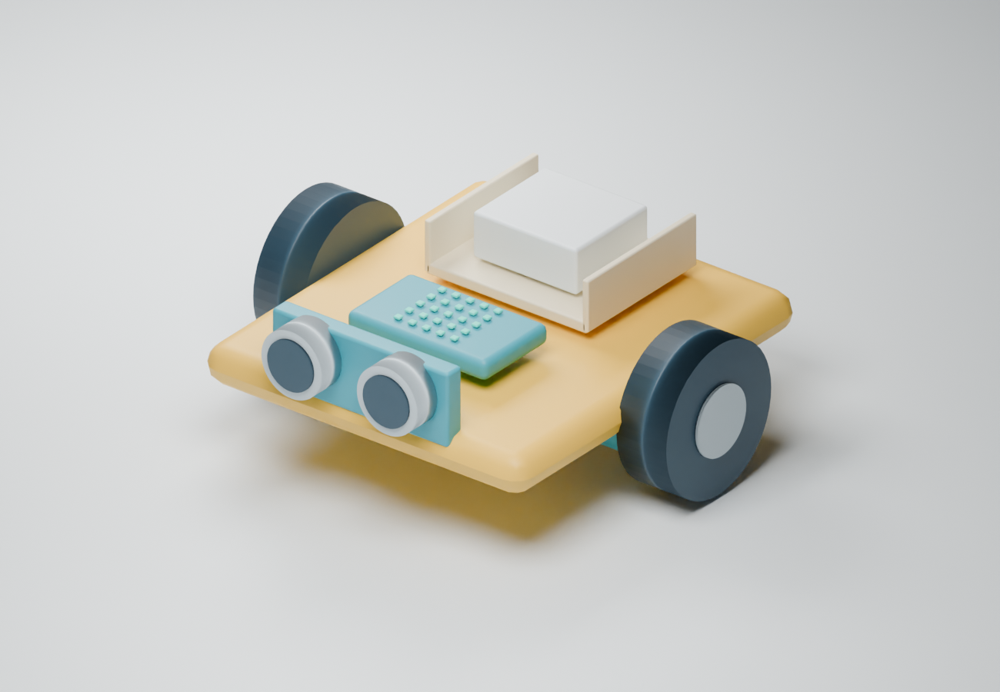

# Robot Mission Lab

**Build it. Code it. Make it yours.**

An independent middle-school robotics course by **Amy Sullivan**. Students build a wheeled robot, learn to control it, test their ideas and choose a new job for the same base.

**[Open the interactive course](https://robotics-mission-lab-amy.luvbuniz.chatgpt.site)** · [Print student packets](https://robotics-mission-lab-amy.luvbuniz.chatgpt.site/workbooks/) · [Teacher guide](dist/teacher-guide.pdf) · [Build worksheets](dist/worksheets/all-modules.pdf) · [Classroom pack](dist/classroom-materials.pdf)



**Grades 6–8 · Eight modules · Sixteen 45-minute classes · Teams of four**

The planned kit is **LEGO Education Computer Science & AI 6–8, #45522**. The course combines a custom interactive website with physical building, written coding steps and printable materials. It runs in a browser without a student account, Articulate subscription or app installation.

## What to explore

- **56 interactive slides:** seven per module, with predictions, practice, feedback, building checklists and reflection.
- **Three playable simulator challenges:** move a brick robot through the grid, earn delivery stars, hear optional sound effects and learn from gentle collision feedback.
- **Eight build worksheets:** materials, measured attachment plans, numbered steps, written program instructions and test tables.
- **Five final builds on one base:** parcel delivery, drawing robot, paper sweeper, ball pusher or a sled carrying a paper rescue figure.
- **Plain-English support:** new words explained in lessons and a glossary in the student and teacher PDFs.
- **Audio and transcripts:** nine short recordings using Amy’s own locally synthesized voice.
- **Teacher materials:** lesson guidance, sample answers, a scoring guide and dated kit cost sheets at the back of both main PDFs.
- **Classroom materials pack:** role cards, arrow cards, color cards, measured paper templates, a first-class script and all eight coding guides.
- **Visual room plan:** hover, focus or tap in the Teacher Desk; the same plan is included in the printable guide.

## A four-minute portfolio walkthrough

1. **Course:** choose Mission 6 and explore how white, red and unknown color readings lead to different actions.
2. **Build:** open its worksheet and connect the learning goal to the actual steps and test table.
3. **Mission simulator:** run a route, use the feedback to change it and download the test notes.
4. **Mission 8:** compare the five final build choices and explain how students choose, test and improve.
5. **Teacher desk:** show the teaching support, word help, scoring guide and cost sheet.

## The eight modules

| Module | What students do | Build worksheet |
| --- | --- | --- |
| 1. Wake up your rover | Connect a color reading to a screen message | [Color-test station](dist/worksheets/module-1.pdf) |
| 2. Make a short drive | Measure movement and make the robot stop | [Measured driving lane](dist/worksheets/module-2.pdf) |
| 3. Build a parcel holder | Compare two holders using the same parcel | [Two parcel holders](dist/worksheets/module-3.pdf) |
| 4. Help your robot read colors | Compare readings and change one test condition | [Color-sensor board](dist/worksheets/module-4.pdf) |
| 5. Plan the delivery route | Put short drives and a turn in order | [Arrow-card route](dist/worksheets/module-5.pdf) |
| 6. Stop at the red line | Use a color reading to choose move or stop | [Red-line station](dist/worksheets/module-6.pdf) |
| 7. Make the delivery | Test the complete robot against three rules | [Delivery course](dist/worksheets/module-7.pdf) |
| 8. Choose a build and show it | Choose one new job, improve it and explain the results | [Five build choices](dist/worksheets/module-8.pdf) |

Modules 1–7 each have a two-page build worksheet. Module 8 has a two-page choice plan and two pages per build. Each team chooses **one** build; teachers can print only the pages that team needs. The full workbook retains the illustrated lesson pages, word help and reflection activities.

## Print one class at a time

Use the [student print center](https://robotics-mission-lab-amy.luvbuniz.chatgpt.site/workbooks/) or download `dist/student-workbooks.zip`.

- Modules 1–7: class 1 is four pages (two sheets); class 2 is two pages (one sheet).
- Module 8: choose one build. Each prepared class packet is four pages (two sheets), including shared planning or reflection pages.
- Print US Letter, Actual size (100%), two-sided, flip on long edge.
- Each class begins with Name, Date and Period. Main text is 13.5-point Arial, with labeled diagrams and space for handwritten results.
- The combined reference PDF retains the glossary and dated cost sheet at the back.

## Teaching readiness

This is a portfolio teaching draft. The worksheet attachments and coding recipes still need real-kit and classroom trials. Before teaching, use LEGO’s official build resources to prepare the shared base, check the sensor mount and attachment points, and make and test the programs in Coding Canvas. The written recipes are guides for making block programs, not importable LEGO project files.

The simulator checks the next square for a wall. The physical course uses a floor-color sensor. The screen activity does not emulate the kit or prove that a real robot will work. Student notes stay in the open page and clear on refresh unless downloaded; there is no student account or server storage.

Automated checks cover simulator solutions, collisions, movement limits, stop behavior, activity grading and color decisions. PDF pages and local download links have been checked. Physical-kit trials and classroom testing have not been completed.

## Run locally

Serve the `dist` folder with any static web server. For example, from the repository root:

```text
python -m http.server 8899 --directory dist
```

Then open `http://localhost:8899/`. Run `npm test` with a current Node.js installation to check the existing simulator and activity tests.

## Files

| Location | Contents |
| --- | --- |
| `dist/` | Complete browser course and public media |
| `dist/course.js` | Curriculum, narration scripts and cost data |
| `dist/slides-data.js` | Eight interactive lesson decks |
| `dist/code/` | Eight written coding guides |
| `dist/worksheets/` | Module build worksheets and combined packet |
| `dist/audio/` | Finished narration and matching transcripts |
| `source/` | Image prompts, original worksheet plans and earlier Blender prototypes |
| `tests/` | Simulator and activity checks |

## Credits and sources

Course design and writing: **Amy Sullivan**. Narration uses Amy’s “My Voice but chipper” voice profile; raw voice samples and clone-profile files are not included. Artwork was generated for this course; the prompts are retained in `source/`. Images show project ideas, not exact kit inventories or verified brick-by-brick instructions. The realistic classroom cover is also an illustration, not a photograph of a verified kit build. The older Blender models are earlier prototypes.

LEGO and related marks belong to the LEGO Group. **Robot Mission Lab is an independent project, not an official LEGO course and not endorsed by the LEGO Group.**

Official kit, building, coding and price references are linked in the Teacher Desk. Cost sheets contain dated US planning figures and should be checked before ordering. The [original Rise course](https://luvbuniz.github.io/robotics/) remains separate; this version demonstrates a custom web learning experience.
